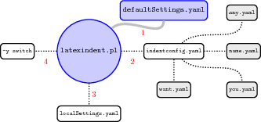

.. label follows

.. _sec:indentconfig:

indentconfig.yaml, local settings and the -y switch 
====================================================

The behaviour of ``latexindent.pl`` is controlled from the settings specified in any of the YAML
files that you tell it to load. By default, ``latexindent.pl`` will only load
``defaultSettings.yaml``, but there are a few ways that you can tell it to load your own settings
files.

indentconfig.yaml and .indentconfig.yaml
----------------------------------------

``latexindent.pl`` will always check your home directory for ``indentconfig.yaml`` and
``.indentconfig.yaml`` (unless it is called with the ``-d`` switch), which is a plain text file you
can create that contains the *absolute* paths for any settings files that you wish
``latexindent.pl`` to load. There is no difference between ``indentconfig.yaml`` and
``.indentconfig.yaml``, other than the fact that ``.indentconfig.yaml`` is a ‘hidden’ file; thank
you to (Diaz 2014) for providing this feature. In what follows, we will use ``indentconfig.yaml``,
but it is understood that this could equally represent ``.indentconfig.yaml``. If you have both
files in existence then ``indentconfig.yaml`` takes priority.

For Mac and Linux users, their home directory is `` /username`` while Windows (Vista onwards) is
``C:\Users\username``\  [1]_ :numref:`lst:indentconfig` shows a sample ``indentconfig.yaml`` file.

.. code-block:: latex
   :caption: ``indentconfig.yaml`` (sample) 
   :name: lst:indentconfig

    # Paths to user settings for latexindent.pl
    #
    # Note that the settings will be read in the order you
    # specify here- each successive settings file will overwrite
    # the variables that you specify

    paths:
    - /home/cmhughes/Documents/yamlfiles/mysettings.yaml
    - /home/cmhughes/folder/othersettings.yaml
    - /some/other/folder/anynameyouwant.yaml
    - C:\Users\chughes\Documents\mysettings.yaml
    - C:\Users\chughes\Desktop\test spaces\more spaces.yaml

Note that the ``.yaml`` files you specify in ``indentconfig.yaml`` will be loaded in the order in
which you write them. Each file doesn’t have to have every switch from ``defaultSettings.yaml``; in
fact, I recommend that you only keep the switches that you want to *change* in these settings files.

To get started with your own settings file, you might like to save a copy of
``defaultSettings.yaml`` in another directory and call it, for example, ``mysettings.yaml``. Once
you have added the path to ``indentconfig.yaml`` you can change the switches and add more code-block
names to it as you see fit – have a look at :numref:`lst:mysettings` for an example that uses four
tabs for the default indent, adds the ``tabbing`` environment/command to the list of environments
that contains alignment delimiters; you might also like to refer to the many YAML files detailed
throughout the rest of this documentation.

:index:`indentation;defaultIndent using YAML file`

.. code-block:: latex
   :caption: ``mysettings.yaml`` (example) 
   :name: lst:mysettings

    # Default value of indentation
    defaultIndent: "\t\t\t\t"

    # environments that have tab delimiters, add more
    # as needed
    lookForAlignDelims:
        tabbing: 1

You can make sure that your settings are loaded by checking ``indent.log`` for details – if you have
specified a path that ``latexindent.pl`` doesn’t recognise then you’ll get a warning, otherwise
you’ll get confirmation that ``latexindent.pl`` has read your settings file. [2]_

:index:`warning;editing YAML files`

.. warning::	
	
	When editing ``.yaml`` files it is *extremely* important to remember how sensitive they are to
	spaces. I highly recommend copying and pasting from ``defaultSettings.yaml`` when you create your
	first ``whatevernameyoulike.yaml`` file.
	
	If ``latexindent.pl`` can not read your ``.yaml`` file it will tell you so in ``indent.log``.
	 

.. label follows

.. _sec:localsettings:

localSettings.yaml and friends
------------------------------

The ``-l`` switch tells ``latexindent.pl`` to look for ``localSettings.yaml`` and/or friends in the
*same directory* as ``myfile.tex``. For example, if you use the following command

:index:`switches;-l demonstration`

.. code-block:: latex
   :class: .commandshell

    latexindent.pl -l myfile.tex

then ``latexindent.pl`` will search for and then, assuming they exist, load each of the following
files in the following order:

#. localSettings.yaml

#. latexindent.yaml

#. .localSettings.yaml

#. .latexindent.yaml

These files will be assumed to be in the same directory as ``myfile.tex``, or otherwise in the
current working directory. You do not need to have all of the above files, usually just one will be
sufficient. In what follows, whenever we refer to ``localSettings.yaml`` it is assumed that it can
mean any of the four named options listed above.

If you’d prefer to name your ``localSettings.yaml`` file something different, (say,
``mysettings.yaml`` as in :numref:`lst:mysettings`) then you can call ``latexindent.pl`` using,
for example,

.. code-block:: latex
   :class: .commandshell

    latexindent.pl -l=mysettings.yaml myfile.tex

Any settings file(s) specified using the ``-l`` switch will be read *after* ``defaultSettings.yaml``
and, assuming they exist, any user setting files specified in ``indentconfig.yaml``.

Your settings file can contain any switches that you’d like to change; a sample is shown in
:numref:`lst:localSettings`, and you’ll find plenty of further examples throughout this manual.

:index:`verbatim;verbatimEnvironments demonstration (-l switch)`

.. code-block:: latex
   :caption: ``localSettings.yaml`` (example) 
   :name: lst:localSettings

    #  verbatim environments - environments specified
    #  here will not be changed at all!
    verbatimEnvironments:
        cmhenvironment: 0
        myenv: 1

You can make sure that your settings file has been loaded by checking ``indent.log`` for details; if
it can not be read then you receive a warning, otherwise you’ll get confirmation that
``latexindent.pl`` has read your settings file.

.. label follows

.. _sec:yamlswitch:

The -y\|yaml switch
-------------------

You may use the ``-y`` switch to load your settings; for example, if you wished to specify the
settings from :numref:`lst:localSettings` using the ``-y`` switch, then you could use the
following command:

:index:`verbatim;verbatimEnvironments demonstration (-y switch)`

.. code-block:: latex
   :class: .commandshell

    latexindent.pl -y="verbatimEnvironments:cmhenvironment:0;myenv:1" myfile.tex

Note the use of ``;`` to specify another field within ``verbatimEnvironments``. This is shorthand,
and equivalent, to using the following command:

:index:`switches;-y demonstration`

.. code-block:: latex
   :class: .commandshell

    latexindent.pl -y="verbatimEnvironments:cmhenvironment:0,verbatimEnvironments:myenv:1" myfile.tex

You may, of course, specify settings using the ``-y`` switch as well as, for example, settings
loaded using the ``-l`` switch; for example,

:index:`switches;-l demonstration`

:index:`switches;-y demonstration`

.. code-block:: latex
   :class: .commandshell

    latexindent.pl -l=mysettings.yaml -y="verbatimEnvironments:cmhenvironment:0;myenv:1" myfile.tex

Any settings specified using the ``-y`` switch will be loaded *after* any specified using
``indentconfig.yaml`` and the ``-l`` switch.

If you wish to specify any regex-based settings using the ``-y`` switch,

:index:`regular expressions;using -y switch`

it is important not to use quotes surrounding the regex; for example, with reference to the ‘one
sentence per line’ feature (:numref:`sec:onesentenceperline`) and the listings within
:numref:`lst:sentencesEndWith`, the following settings give the option to have sentences end with
a semicolon

:index:`switches;-y demonstration`

.. code-block:: latex
   :class: .commandshell

    latexindent.pl -m --yaml='modifyLineBreaks:oneSentencePerLine:sentencesEndWith:other:\;'

.. label follows

.. _sec:loadorder:

Settings load order
-------------------

``latexindent.pl`` loads the settings files in the following order:

:index:`switches;-l in relation to other settings`

#. ``defaultSettings.yaml`` is always loaded, and can not be renamed;

#. ``anyUserSettings.yaml`` and any other arbitrarily-named files specified in
   ``indentconfig.yaml``;

#. ``localSettings.yaml`` but only if found in the same directory as ``myfile.tex`` and called with
   ``-l`` switch; this file can be renamed, provided that the call to ``latexindent.pl`` is adjusted
   accordingly (see :numref:`sec:localsettings`). You may specify both relative and absolute paths
   to other YAML files using the ``-l`` switch, separating multiple files using commas;

#. any settings specified in the ``-y`` switch.

A visual representation of this is given in :numref:`fig:loadorder`.

.. label follows

.. _fig:loadorder:

   

   Schematic of the load order described in :numref:`sec:loadorder`; solid lines represent
   mandatory files, dotted lines represent optional files. ``indentconfig.yaml`` can contain as many
   files as you like. The files will be loaded in order; if you specify settings for the same field
   in more than one file, the most recent takes priority. 

.. raw:: html

   

.. raw:: html

   

Diaz, Jacobo. 2014. “Hiddenconfig.” July 21. https://github.com/cmhughes/latexindent.pl/pull/18.

.. raw:: html

   

.. raw:: html

   

.. [1]
   If you’re not sure where to put ``indentconfig.yaml``, don’t worry ``latexindent.pl`` will tell
   you in the log file exactly where to put it assuming it doesn’t exist already.

.. [2]
   Windows users may find that they have to end ``.yaml`` files with a blank line
